# Fluma specimen gallery

These are the 22 original specimen exports supplied by Baturay Kocatepe. Image license: [CC BY-SA 4.0](image-license.txt).

## Specimen 01

## Specimen 02

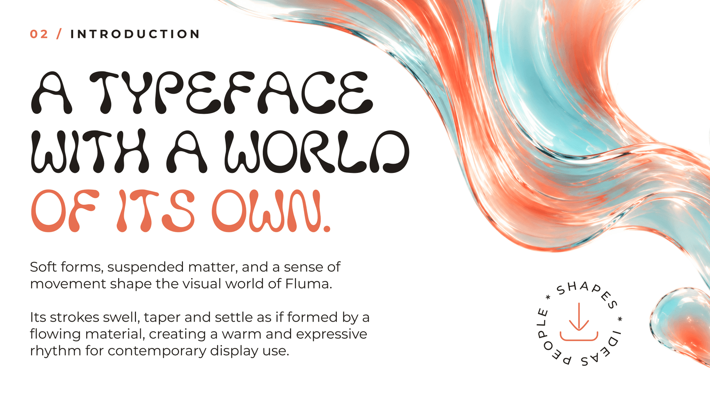

## Specimen 03

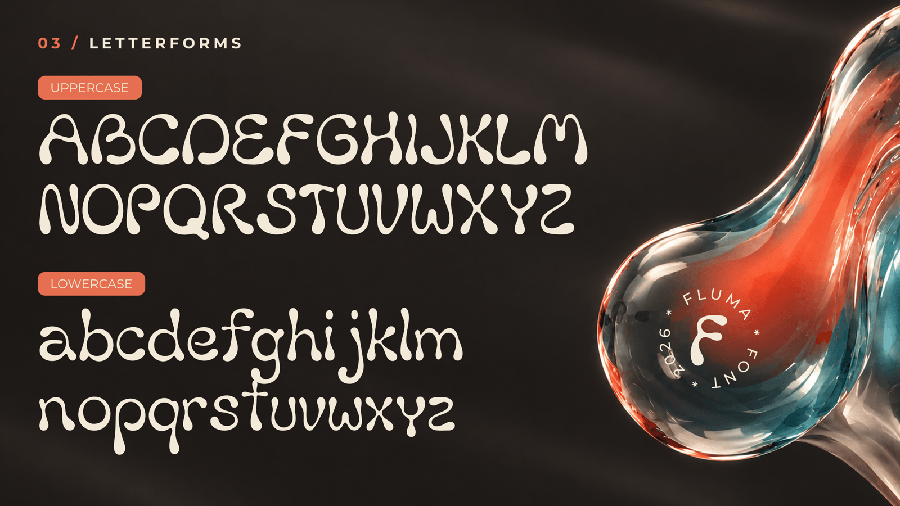

## Specimen 04

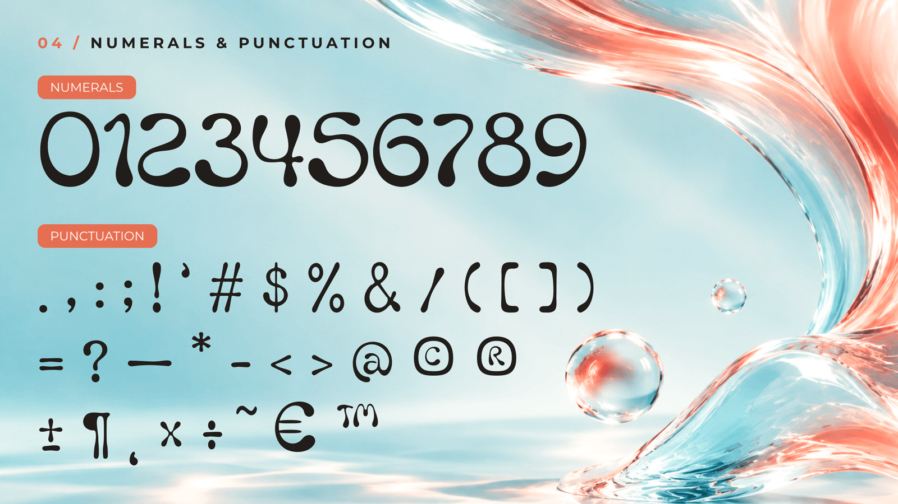

## Specimen 05

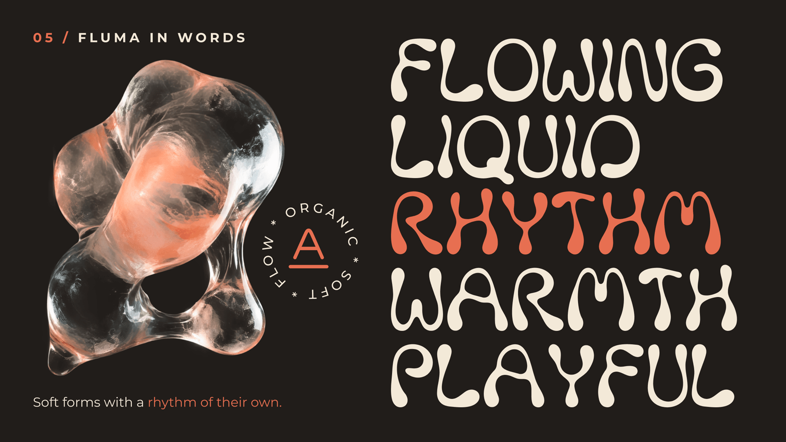

## Specimen 06

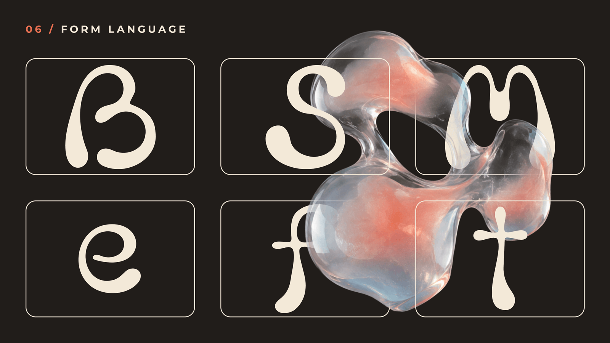

## Specimen 07

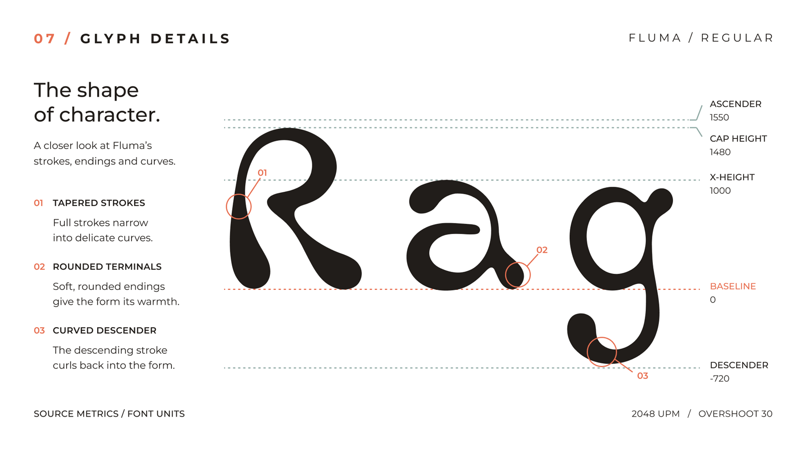

## Specimen 08

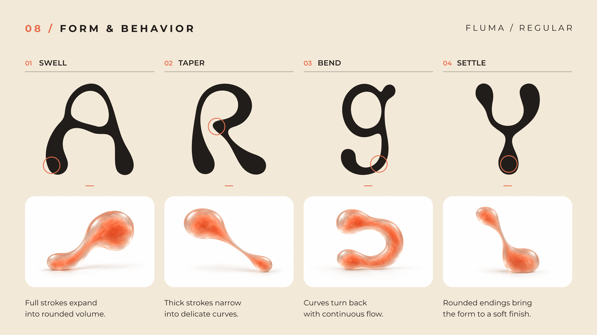

## Specimen 09

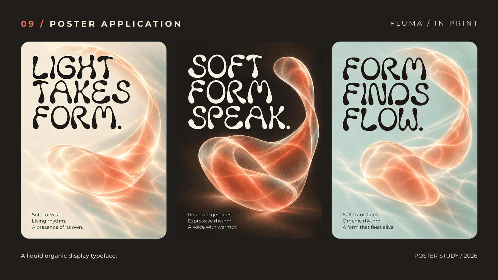

## Specimen 10

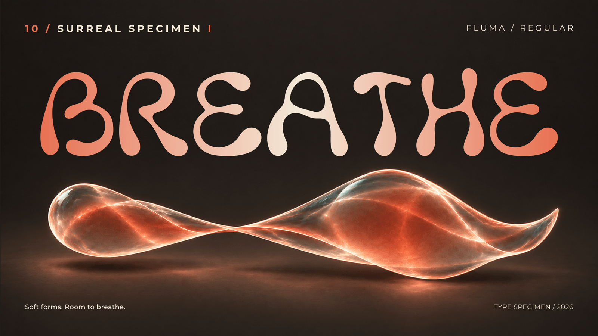

## Specimen 11

## Specimen 12

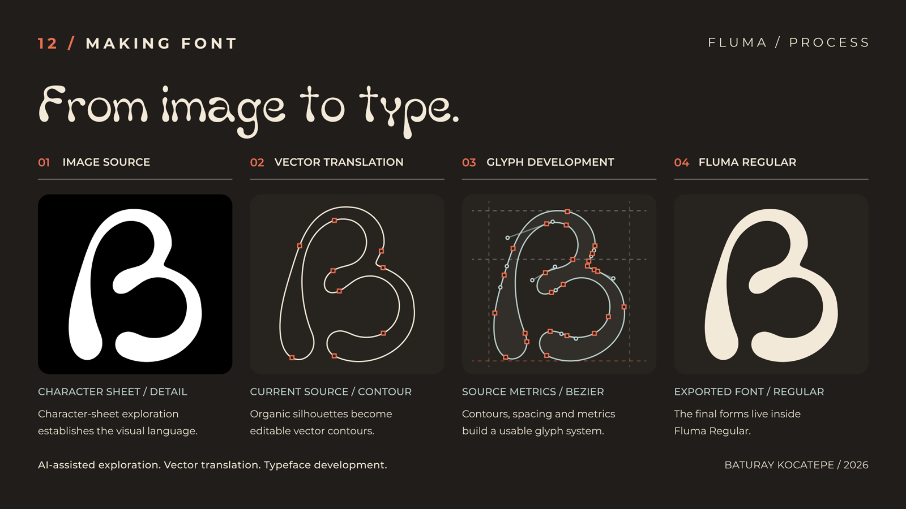

## Specimen 13

## Specimen 14

## Specimen 15

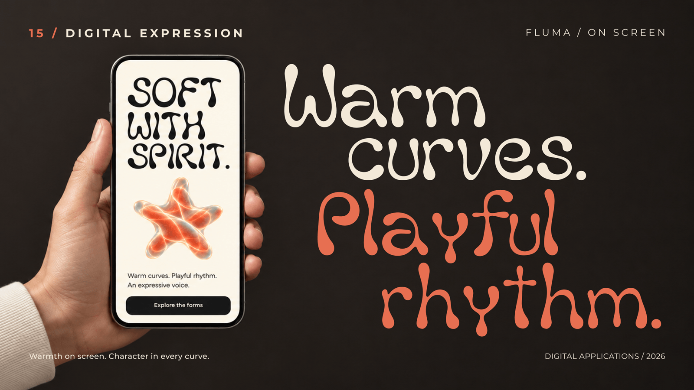

## Specimen 16

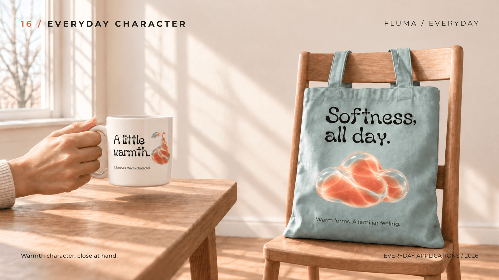

## Specimen 17

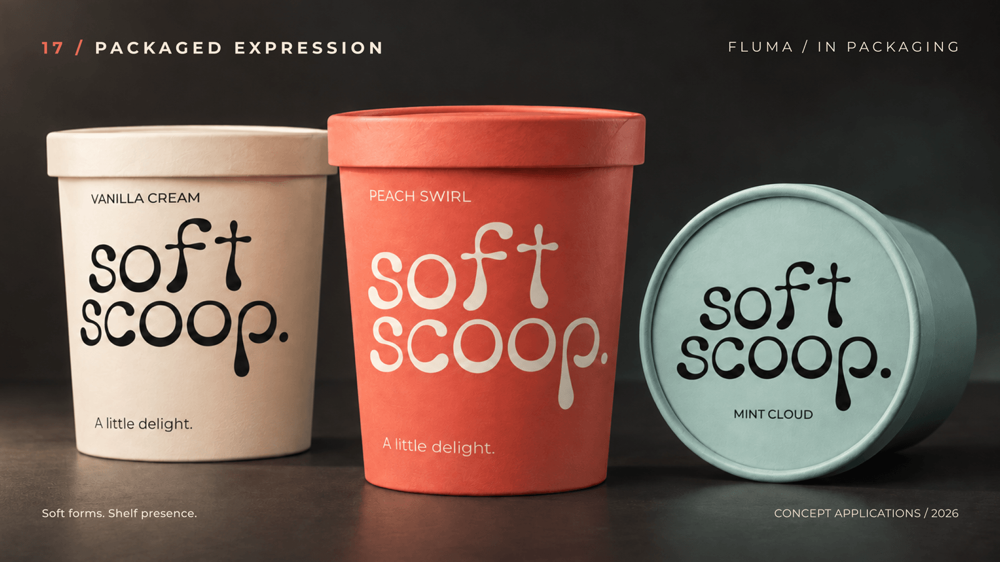

## Specimen 18

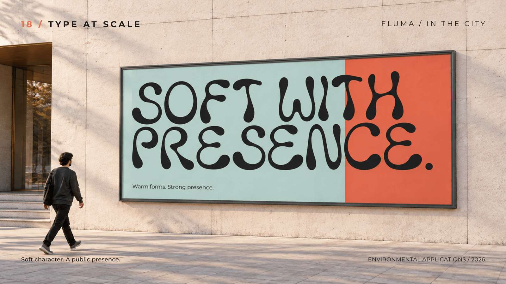

## Specimen 19

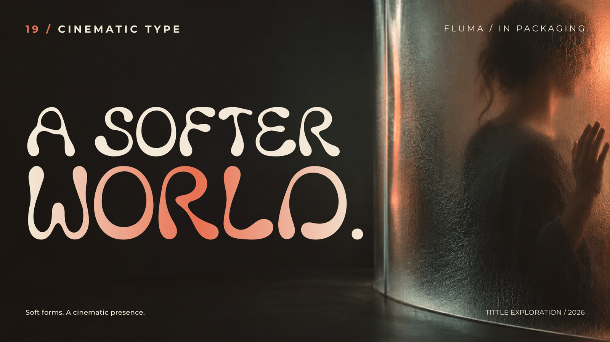

## Specimen 20

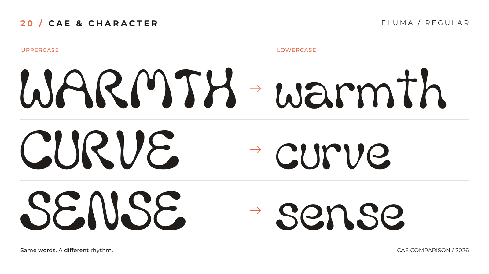

## Specimen 21

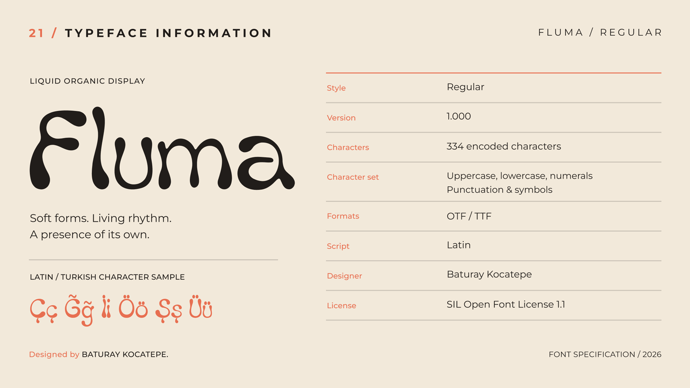

This image records the original 334-character export. The current rebuilt font maps 337 Unicode codepoints. The image is retained unchanged as part of the original specimen series.

## Specimen 22

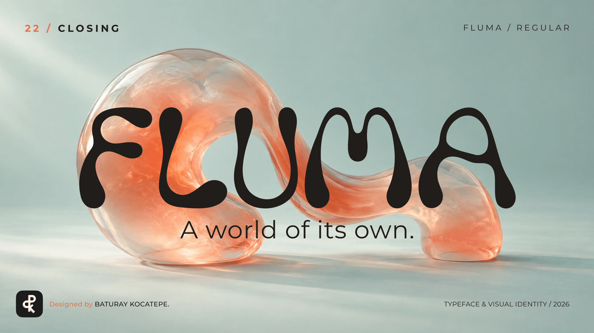
